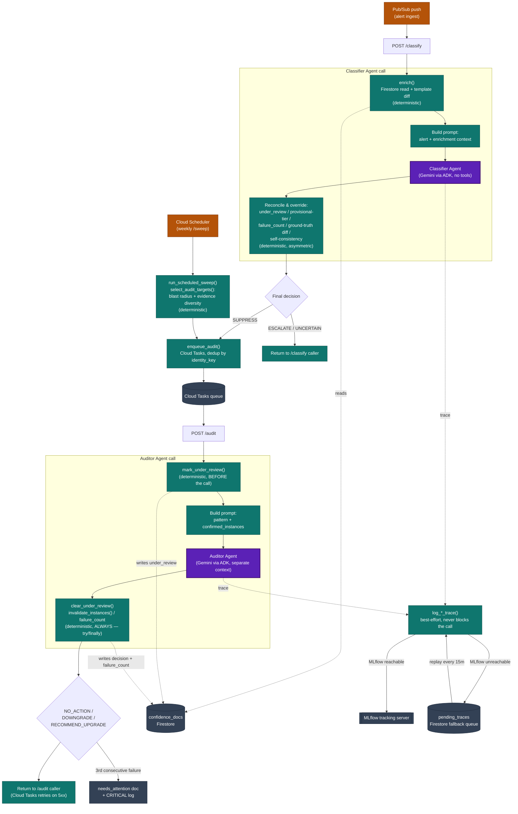

# Vör — Agent Data Flow

How data moves through the two LLM-calling entry points, `classify_alert()`
and `audit_pattern()`. The recurring shape: **deterministic Python before
the agent call, deterministic Python after it — the agent itself never
reads or writes Firestore, never has tools, and never gets the final say**
(see `README.md`'s "Design principle carried through the scaffold" and
every override in `orchestrator.py`). This diagram makes that shape
visible end to end, including the trigger paths and observability work
specified in `docs/superpowers/specs/2026-08-24-*.md` and planned in
`docs/superpowers/plans/2026-08-24-*.md`.

## Reading the diagram

- **Purple = the only two places an LLM is called.** Everything else —
  every arrow into or out of Firestore, every decision override, every
  trigger — is plain deterministic Python. Neither agent has ADK
  `tools=` attached; this is a deliberate scaffold choice, not an
  accident (see `README.md`).
- **The Classifier Agent never sees Firestore directly.** `enrich()`
  reads the confidence doc *before* the call and serializes exactly what
  the agent gets to reason over; nothing the agent asks for is fetched
  live. Same for the Auditor Agent and `confirmed_instances`.
- **The agent's own decision is never final.** `Reconcile` is where
  `under_review`, provisional-tier, `failure_count` (once
  `docs/superpowers/plans/2026-08-24-audit-failure-escalation.md`
  lands), the ground-truth deviation diff, and the model's own
  self-consistency all get to override a `SUPPRESS` the model returned —
  each one forces the safe direction in code rather than asking the
  model to reconsider. This is the same asymmetric-trust pattern as the
  Auditor's `DOWNGRADE` (autonomous, safe) vs.
  `RECOMMEND_UPGRADE_FOR_HUMAN_REVIEW` (human-gated, risky).
- **Two independent triggers feed one audit path.** A `SUPPRESS` from
  `/classify` and a scheduled `/sweep` selection both just call
  `enqueue_audit()` — from there, every audit runs through the identical
  `POST /audit` → Auditor Agent path, regardless of which trigger fired
  it.
- **Tracing never gates the agent path.** Both agent calls log to MLflow
  best-effort; a tracking-server outage degrades to a durable Firestore
  queue and a scheduled replay, never to a failed classification or
  audit (`docs/superpowers/plans/2026-08-24-mlflow-tracing.md`).

## Status

Solid edges (Pub/Sub trigger, Cloud Tasks enqueue/dispatch, both agent
calls, `confidence_docs` reads/writes) are implemented and tested today.
`needs_attention` and the MLflow tracing branch are specced and planned
(`docs/superpowers/specs/`, `docs/superpowers/plans/`) but not yet built —
see `docs/TODO-Aug24.md` for current status.
